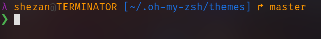
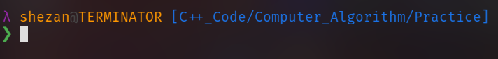
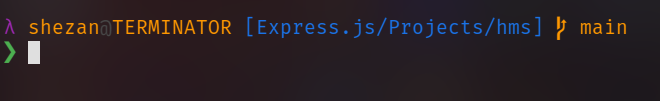
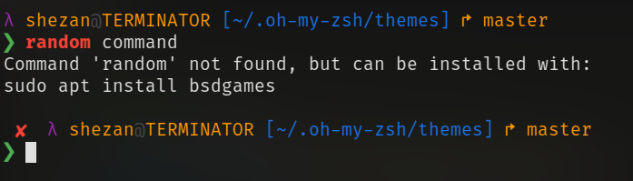

# Lagnoda - A ZSH Theme



**lagnoda: A ZSH Theme Inspired by agnoster and lambda**

This ZSH theme, lagnoda, draws inspiration from the popular agnoster and Lambda themes, offering a clean and informative prompt that adapts to your current context.



## Key Features:
- Context-aware: Only displays relevant information like git status, virtual environment name, and background jobs when needed.
- Customizable: Supports the Solarized color theme and allows adjusting the foreground color for the current segment.
- Clean and lean: Leverages functions for modularity and a well-structured prompt.
- AWS Profile Integration: Displays the current AWS profile name with color-coded status for production environments.

## Installation:
Clone this repository: 
  ```bash
  wget https://github.com/jashezan/lagnoda/raw/main/lagnoda.zsh-theme -O "$ZSH/themes/lagnoda.zsh-theme"
  ```
  > Assuming you have Oh My Zsh installed with the themes directory set to $ZSH/themes

Add the following line to your ~/.zshrc file:
  ```bash
  ZSH_THEME="lagnoda"
  ```
*(Optional) Set the `SOLARIZED_THEME` variable in your `~/.zshrc` to `"light"` if you're using the light variant of the Solarized color scheme.*



## Further Customization:
The theme provides flexibility for adjustments. Explore the code within the prompt_segment function to modify the foreground color for different segments.



## Compatibility:
This theme requires Oh My Zsh to be installed.

## Contributing:
Feel free to submit pull requests for improvements or additional features!
